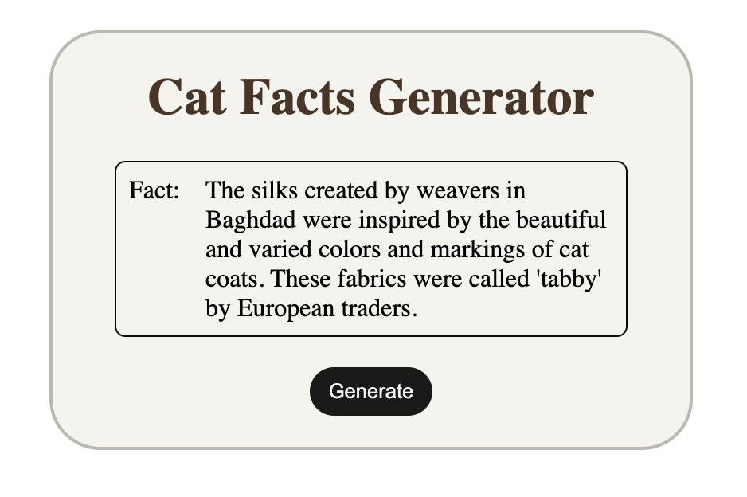

# 🐱 Cat Facts Generator

A simple web application that generates random cat facts using the Cat Facts API. Built with HTML, CSS, and JavaScript, this project demonstrates API fetching, asynchronous JavaScript, DOM manipulation, and error handling.

## 🚀 Features

* Generate random cat facts with a single click
* Fetches data from an external API
* Loading state while fetching facts
* Handles API and network errors gracefully
* Clean and responsive user interface

## 🛠️ Technologies Used

* HTML5
* CSS3
* JavaScript (ES6+)
* Fetch API

## 📂 Project Structure

```text
cat-facts-generator/
│
├── index.html
├── preview.png
├── style.css
├── app.js
└── README.md
```

## 🔗 API Used

Cat Facts API:

https://catfact.ninja/fact

## 📸 Preview




## ▶️ How to Run

1. Clone the repository:

```bash
git clone https://github.com/itsArvindSingh/cat-facts-generator.git
```

2. Open the project folder.

3. Open `index.html` in your browser.

4. Click the **Generate** button to get a random cat fact.

## 📚 Concepts Practiced

* Async/Await
* Fetch API
* Error Handling with Try/Catch
* DOM Manipulation
* Event Listeners
* Dynamic Content Rendering


